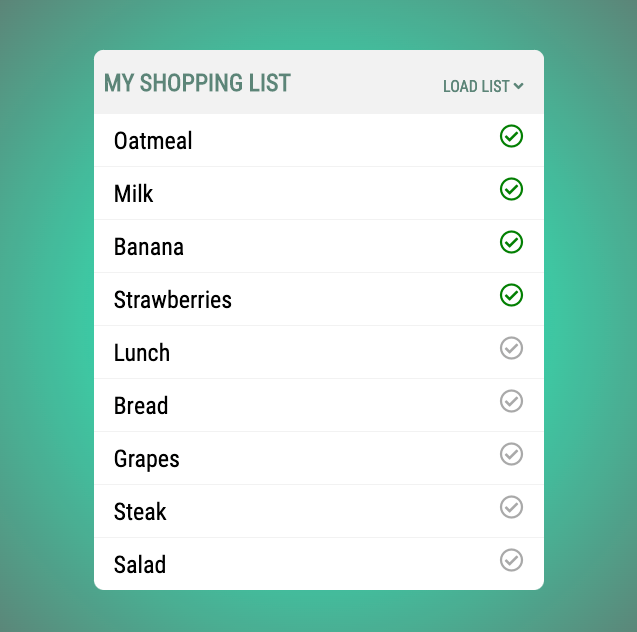
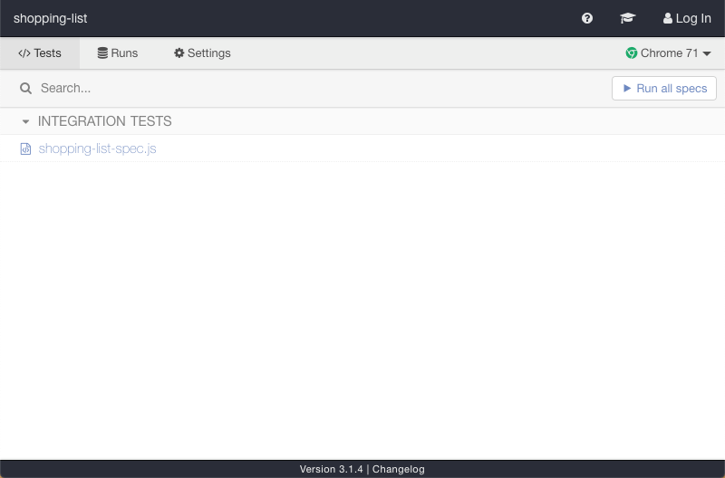
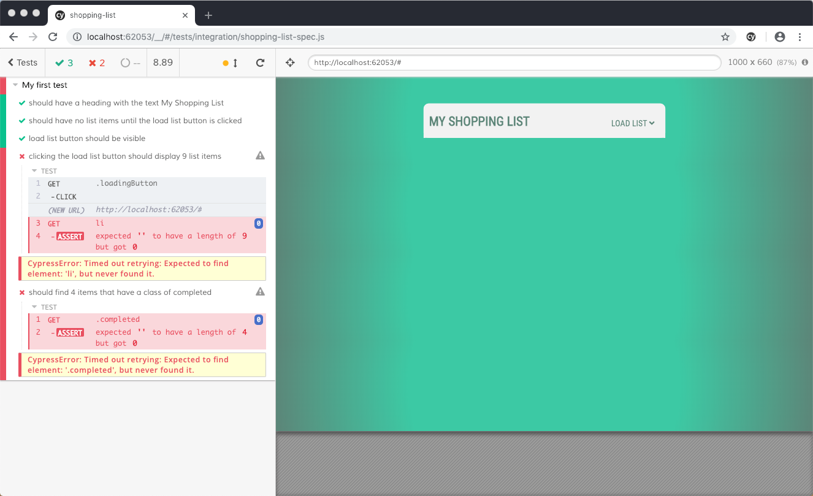

# Fetch & Promises Exercise

In this exercise you will take a lot of the lesson you learned in the tutorial and lecture and build your own shopping list application. 

The list of items is not loaded by default. You will need to click on the load list button, fetch the items from a JSON file and then display them on the page. When you are done you should end up with a solution that looks something like this. 

## Setup

The starter code for this project is located in the `shopping-list` folder located in this directory. This project uses npm for its dependencies so before you do anything you will need to `cd shopping-list` and run `npm install`.

### Automated Tests

The only dependency you are pulling in is cypress which is an end to end testing framework. This was mentioned during testing Vue components but we didn't have a chance to cover it. Not to worry though, all you need it for is to verify that your exercise is doing what it should. 

If you run the command `npm run test` from the command line you will see a single integration test for this project `shopping-list-spec.js`. 

If you click on it you should see 3 tests pass and the final 2 fail.

## Instructions 

To make this application work you will need to the following:

* When a user clicks the load list button
    * fetch the list of groceries from `assets/data/shopping-list.json`
* iterate over the array of groceries and apply the following data to the `<template>`
    * name: Add the name to the list item
    * completed: If the item is completed add the completed class to the circle icon.
    * append the template to the `<ul>` on your page

## Bug Fix

You might have noticed this already but there is a problem with your application. If everything is working ok you can click on the load list button and the shopping list is loaded. What happens if you click on the button again? How can you fix this? There is no one right answer here so think through your solution and add comments where you can. 

## Part 2 (Required)
​
For more practice using a REST API, modify your application to read the shopping list items from the API you created last week.
​
Replace the path to the local JSON file with the URL of your API in your fetch statement, and the list should populate based on the API data.
​
## Bonus (Not Required)
​
Add the event handlers you wrote for toggling the completed status of items in the grocery list. Once those are working, add the necessary code so that a PUT request is also sent to the API to update the item's completed property. You can confirm this is working by completing an item, reloading the page and the list of items, and observing that the status is still completed (i.e. it doesn't reset on reloading).

Hint https://medium.com/@9cv9official/what-are-get-post-put-patch-delete-a-walkthrough-with-javascripts-fetch-api-17be31755d28
