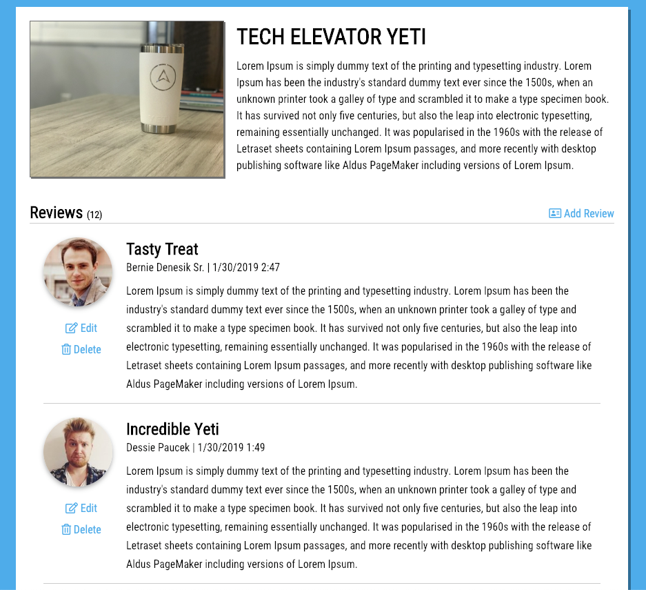

# REST API Lecture

In today's lecture, you will be working on a product review application. The product at the top of the page is a Tech Elevator Yeti. On the same page, you will list several reviews. These reviews will come from a mock API and you will have the ability to list, create, read, update, and delete. During the lecture, you will be building out all of the REST API calls that perform those actions.

## Starter Code

The starter code for this lecture is located in this directory in a folder named `product-reviews`.

## Mock API

To follow along you can use the mock API clone link below to create your copy of the Product Reviews project.

https://www.mockapi.io/clone/5e5925f17777050014463270
